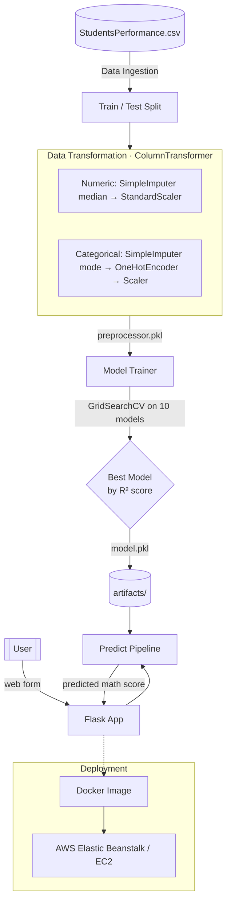

# 🎓 Student Exam Performance Predictor — End-to-End ML Project

An end-to-end Machine Learning project that predicts a student's **math exam score** from demographic and academic features. It implements the complete ML lifecycle — modular data ingestion, preprocessing, multi-model training with hyperparameter tuning, a Flask web interface for live predictions, and AWS deployment via Docker and Elastic Beanstalk.

<p align="center">
  
  
  
  
  
  
  
</p>

---

## 📌 Table of Contents

- [Overview](#-overview)
- [Problem Statement](#-problem-statement)
- [Architecture](#-architecture)
- [Tech Stack](#-tech-stack)
- [Project Structure](#-project-structure)
- [Pipeline Stages](#-pipeline-stages)
- [Getting Started](#-getting-started)
- [Usage](#-usage)
- [Deployment](#-deployment)
- [Author](#-author)

---

## 🔍 Overview

This project predicts how a student will perform in their **math exam** based on background information and their reading/writing scores. It is built as a **modular, reusable ML package** with custom exception handling and logging, separating data ingestion, transformation, and model training into independent components — then wraps the trained model in a **Flask** web app where users can enter details and get an instant prediction.

**Key highlights**

- Modular `src` package installable via `pip install -e .`
- Clean preprocessing with `ColumnTransformer` (numeric + categorical pipelines)
- **10 regression models** trained and tuned via `GridSearchCV`, best model auto-selected by R² score
- Interactive **Flask** web form for real-time predictions
- **Dockerized** and deployed on **AWS** (Elastic Beanstalk config + CI/CD)

---

## 🎯 Problem Statement

Predict a student's **math score** (target) using the following inputs:

| Feature | Type | Description |
|---------|------|-------------|
| `gender` | Categorical | Student's gender |
| `race_ethnicity` | Categorical | Group A–E |
| `parental_level_of_education` | Categorical | Highest parental education |
| `lunch` | Categorical | Standard / free-reduced |
| `test_preparation_course` | Categorical | Completed / none |
| `reading_score` | Numerical | Reading exam score |
| `writing_score` | Numerical | Writing exam score |

> Dataset: `StudentsPerformance.csv` — a regression task evaluated using the **R² score**.

---

## 🏗 Architecture



---

## 🧰 Tech Stack

| Layer | Technologies |
|-------|--------------|
| **Language** | Python 3.10 |
| **Data Handling** | Pandas, NumPy |
| **Preprocessing** | Scikit-Learn (`ColumnTransformer`, `SimpleImputer`, `OneHotEncoder`, `StandardScaler`) |
| **Modeling** | Scikit-Learn (Linear, Lasso, Ridge, KNN, DecisionTree, RandomForest, GradientBoosting, AdaBoost), **XGBoost**, **CatBoost** |
| **Tuning / Eval** | GridSearchCV, R² score |
| **Web App** | Flask, Jinja2 (HTML templates) |
| **Visualization** | Matplotlib, Seaborn |
| **Packaging** | setuptools (`setup.py`) |
| **Deployment** | Docker, AWS Elastic Beanstalk (`.ebextensions`), GitHub Actions (CI/CD) |

---

## 📂 Project Structure

```
BigProject/
├── src/                              # Core installable package
│   ├── components/
│   │   ├── data_ingestion.py         # Read CSV → train/test split → artifacts/
│   │   ├── data_transformation.py    # ColumnTransformer preprocessing → preprocessor.pkl
│   │   └── model_trainer.py          # Train + tune 10 models → best model.pkl
│   ├── pipeline/
│   │   └── predict_pipeline.py       # CustomData + PredictPipeline for inference
│   ├── exception.py                  # CustomException
│   ├── logger.py                     # Logging configuration
│   └── utils.py                      # save_object / load_object / evaluate_models
│
├── notebook/
│   └── data/StudentsPerformance.csv  # Raw dataset + EDA notebooks
├── templates/
│   ├── index.html                    # Landing page
│   └── home.html                     # Prediction form + result
├── artifacts/                        # data.csv, train.csv, test.csv, model.pkl, preprocessor.pkl
├── catboost_info/                    # CatBoost training logs
├── logs/                             # Runtime logs
│
├── .ebextensions/python.config       # AWS Elastic Beanstalk config (WSGIPath)
├── .github/workflows/                # CI/CD pipeline
├── Dockerfile                        # Container build (python:3.10-slim, Flask :5000)
├── .dockerignore
├── app.py                            # Flask application entry point
├── requirements.txt
└── setup.py
```

---

## ⚙️ Pipeline Stages

1. **Data Ingestion** — Reads `StudentsPerformance.csv`, performs a train/test split, and writes `data.csv`, `train.csv`, and `test.csv` to the `artifacts/` folder.
2. **Data Transformation** — Builds a `ColumnTransformer` combining a **numeric pipeline** (median imputation → standard scaling) and a **categorical pipeline** (most-frequent imputation → one-hot encoding → scaling); saves the fitted `preprocessor.pkl`.
3. **Model Training** — Trains **10 regressors** and tunes them with `GridSearchCV`, evaluates each on the **R² score**, selects the best performer, and serializes it to `model.pkl`.
4. **Prediction Pipeline** — `CustomData` packages form inputs into a DataFrame; `PredictPipeline` loads the preprocessor + model and returns the predicted math score.

---

## 🚀 Getting Started

### Prerequisites

- Python 3.10
- (Optional) Docker

### Installation

```bash
# 1. Clone the repository
git clone https://github.com/deva3004/BigProject.git
cd BigProject

# 2. Create and activate a virtual environment
python -m venv venv
source venv/bin/activate        # Windows: venv\Scripts\activate

# 3. Install dependencies (editable install)
pip install -r requirements.txt
```

---

## 💻 Usage

**1. Train the model** (runs ingestion → transformation → training)

```bash
python src/components/data_ingestion.py
```

**2. Run the Flask web app**

```bash
python app.py
```

Then open **http://localhost:5000** and go to `/predictdata` to enter student details and get a predicted math score.

---

## ☁️ Deployment

**Docker**

```bash
# Build the image
docker build -t studentperformance .

# Run the container
docker run -p 5000:5000 studentperformance
```

**AWS**
- `.ebextensions/python.config` configures **AWS Elastic Beanstalk** (`WSGIPath: application:application`).
- A **GitHub Actions** workflow handles CI/CD — building the Docker image and deploying to AWS (Amazon ECR + EC2 / Elastic Beanstalk).

---

## 👤 Author

**Devashish Tripathi**
📧 tripathidevashish07@gmail.com
🔗 [GitHub](https://github.com/deva3004)

---

⭐ If you find this project useful, consider giving it a star!
